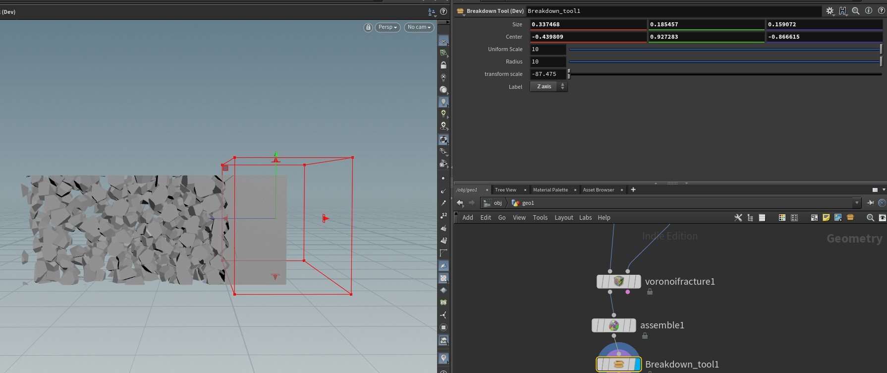
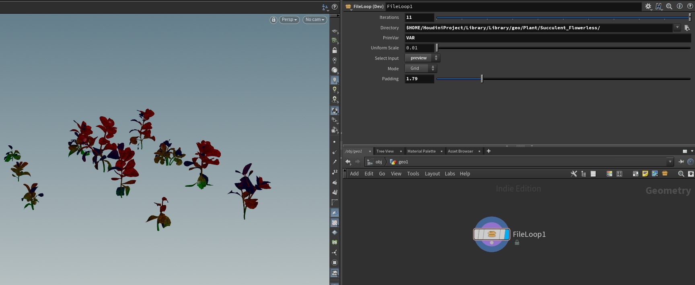

# My HDA Library

Bienvenue dans ma librairie d'outils Houdini Digital Assets (HDA), conçue pour faciliter différentes étapes de la production 3D, notamment en Solaris.

---

## Table des matières

- [BreakDown Tool](#breakdown-tool)
- [File Loop](#file-loop)
- [BuildUSD](#buildusd)
- [USD Converter](#usd-converter)
- [HDA LookDev Tool](#hda-lookdev-tool)

---

# BreakDown Tool

> **Contexte :** OBJ  
> **Fonction :** Préparer la décomposition d'un mesh packé

Cet outil permet de séparer chaque pièce d’un mesh packé en les déplaçant légèrement à l’aide de leur boîte englobante. Idéal pour des présentations, du debug ou des breakdowns de modélisation.

---

#File Loop

> **Contexte :** Solaris / OBJ  
> **Fonction :** Importer un dossier de fichiers USD

Ce HDA lit tous les fichiers contenus dans un dossier et les place automatiquement au centre de la scène. Il permet également d’aligner tous les meshes pour une meilleure visualisation. Parfait en amont du prochain outil : `BuildUSD`.

---

# BuildUSD

> **Contexte :** Solaris / Stage  
> **Fonction :** Créer des variations d’assets USD

`BuildUSD` prend en entrée tous les meshes alignés, applique les variations de matériaux et de géométrie, crée une galerie d’assets avec vignettes, puis sauvegarde automatiquement les fichiers USD dans un dossier au choix (géométries, matériaux, variations, asset final).

---

## USD Converter

> **Contexte :** Solaris  
> **Fonction :** Convertir et standardiser un dossier 3D en USD

Le convertisseur USD permet de transformer automatiquement une collection de fichiers 3D en un seul fichier USD prêt à l'emploi. Idéal pour centraliser et intégrer des ressources dans une bibliothèque d’assets.

### Fonctionnalités :
- Transformation globale (scale, rotation, alignement)
- Gestion des variations de nom
- Ajout de préfixes sur les textures
- Assignation automatique de géométries, matériaux et textures
- Export facile du fichier USD
- Intégration directe dans une bibliothèque d’assets

### Utilisation :
1. Indiquez le chemin vers votre dossier 3D.
2. L’outil assigne automatiquement les géométries, matériaux et textures.
3. Appliquez les transformations nécessaires.
4. Précisez les préfixes de texture si besoin.
5. Exportez le fichier USD.
6. Ajoutez-le à votre asset
