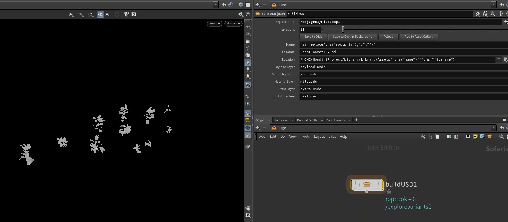

# My HDA Library

Welcome to my library of Houdini Digital Assets (HDAs), designed to streamline various stages of 3D production, particularly within Solaris.

---

## Table of Contents

- [BreakDown Tool](#breakdown-tool)
- [File Loop](#file-loop)
- [BuildUSD](#buildusd)
- [USD Converter](#usd-converter)
- [HDA LookDev Tool](#hda-lookdev-tool)

---

## BreakDown Tool

> **Context:** SOP  
> **Function:** Prepare a packed mesh breakdown

This tool separates each piece of a packed mesh by slightly offsetting them based on their bounding boxes. Ideal for presentations, debugging, or modeling breakdowns.

---

## File Loop

> **Context:** Solaris / OBJ  
> **Function:** Import a folder of USD files

This HDA reads all the files in a given folder and places them at the center of the scene. It also aligns all meshes for better visualization — perfect as input for the next tool: `BuildUSD`.

---

## BuildUSD

> **Context:** Solaris / Stage  
> **Function:** Create USD asset variations

`BuildUSD` takes all aligned meshes, applies geometry and material variations, generates an asset gallery with thumbnails, and automatically saves the USD files in a chosen folder (geometry, materials, variations, final asset).

---

## USD Converter

> **Context:** Solaris  
> **Function:** Convert and standardize a 3D folder into USD

The USD Converter automatically transforms a collection of 3D files into a single, ready-to-use USD file. Perfect for consolidating and integrating assets into a unified asset library.

### Features:
- Global transformations (scaling, rotation, alignment)
- Name variation handling
- Texture prefix options
- Automatic assignment of geometries, materials, and textures
- Easy USD export
- Direct integration into your asset library

### How to use:
1. Provide the path to your 3D file directory.
2. The tool will automatically assign all geometries, materials, and textures.
3. Apply any required transformations.
4. Set texture prefixes if needed.
5. Export the resulting USD file.
6. Add the USD file to your asset library.

---

## HDA LookDev Tool

> **Context:** OBJ  
> **Function:** One-click Look Development setup

This HDA sets up a complete scene environment to simplify Look Development.

### Scene Elements:
- **Color Checker**: For accurate color calibration.
- **Reference Spheres**:
  - Metallic sphere (reflective reference)
  - Matte sphere (diffuse reference)
- **Ground plane with HDRI projection**: For realistic lighting using an HDRI.
- **Light Source**: Complements the HDRI with additional control.
- **Camera Constraints**: Optionally lock reference elements to the camera to maintain consistent framing.

